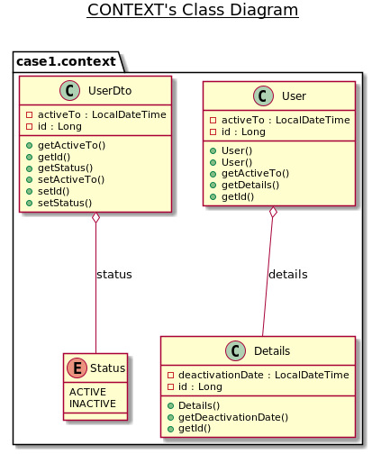

## Intro

The Patient is calculating a User's status based on multiple dates.

```
        activeTo    deactivationDate
-----------|---------------||----------


    deactivationDate   activeTo
----------||---------------|-----------
```

### Context
> Note this is the structure before the refactoring.



## Symptoms

The Patient presents to the emergency room with the following symptoms:

- long method
- code duplication
- too many if, nested if => high cyclomatic complexity
- too many return statements
- void method with input-output parameter
- too complex parameters
- refactor date positions + stronger domain model
- date.compareTo() is low level
